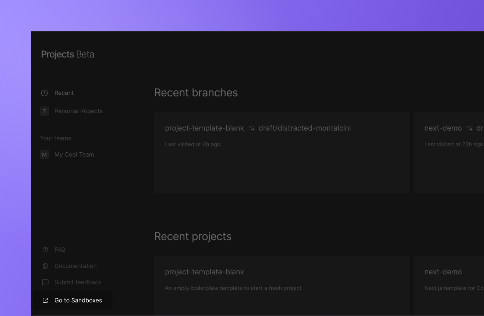

import Callout from 'nextra-theme-docs/callout'

# Team and access management

<Callout>
Please note currently CodeSandbox Projects heavily relies on permissions from GitHub. In the future we're going to change this but until then please keep this in mind.
</Callout>

## Teams

Currently, you can orgianize your work under Personal Projects and Teams inside CodeSandbox Projects. Your teams are synced across Sandboxes and Projects and every member of the given team can navigate between the already imported projects. During the open beta, Projects provides the visibility of projects to teams rather than options to manage permissions or access control. We have to admit, probably you set up permissions on GitHub by this time so Projects can rely on your existing settings.

### Mangage your team

Managing your team is possible through the Sandboxes dashboard. 

On the sandboxes dashboard you can change to any of your teams and with clicking the gear icon you can manage your existing team. Would you like to create a new team? You can create a new team on the sandboxes dashboard as well.

### Add new team members

Under the team settings, you can invite users to the team by inviting them via email or searching for their CodeSandbox username.

## User roles

You can consider the different user roles below who can interact or visit Projects. Please read more about the permissions [here](https://codesandbox.io/docs/projects/teams/permissions).

### Users with write access to your repository

Users with write access to the given repository can unleash the full potential of CodeSandbox Projects and use it for their development workflow.

### Users with read-only access to your repository

Users with read-only access to the given repository can still browse the content of your project, check the previews, or even execute different tasks. For sure, they can't introduce changes but there is an option for them to create a fork and then run the project by their own without affecting the upstream repository. Furthemore, they can even contribute back to the original projects easily with CodeSandbox Projects. You can read more about this on the [open source contrubution page](https://codesandbox.io/docs/projects/docs/getting-started/open-source-collaboration).

### Anonymous users

CodeSandbox Projects also provides an option to make a project accessible for users without a CodeSandbox Account. Anonymous users can also open a public repository from GitHub if it's imported to Projects. 

