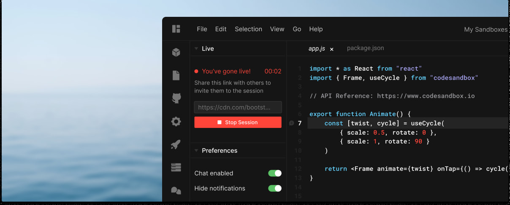
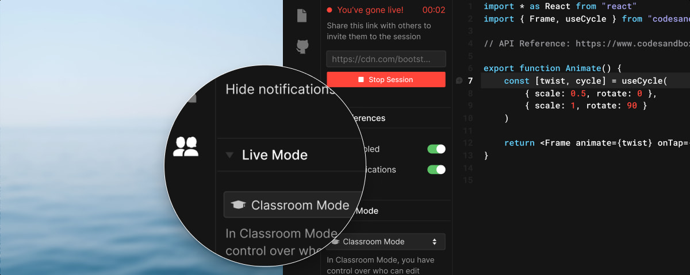

import { Tabs, WrapContent } from '../../../../../shared-components/Tabs'

# Collaborate & Share
At CodeSandbox, we believe that collaborating on code should be as easy as possible. As we have grown and evolved our tools, we have also expanded our options for working together. 

<Tabs tabs={["Sandboxes", "Repositories"]}>
    <WrapContent>
      ### Collaboration with Live
#### What is Live?
All sandboxes on CodeSandbox are live, meaning you can share your sandbox with
others for real time collaboration on code. You can simultaneously create,
delete, edit and move files and code with others in a sandbox, as well as chat
about your changes. It's like Google Docs, but for coding.

       

#### Going Live
All sandboxes are live by default, you can invite contributors to join the
sandbox using the share button from the top bar in the editor. In addition, if
you go to the Live tab from the activity bar, you can get a Live URL to share with
other CodeSandbox users (they will not need to be members of the Sandbox). 
Live editors can only make edits to the sandbox while they are in the
session, they cannot do this when just viewing the sandbox.

Invited editors can simultaneously edit, create, rename and update files and
code, as well as add and remove dependencies. You can also see which file other
collaborators are looking at and what their current selections are.

       

#### Classroom Mode
With Classroom Mode you can define who can edit the sandbox. This is especially
useful when working with large groups. You will only see the cursors of the
users that are 'editor'.

You can enable Classroom Mode from the Live Mode drop-down menu.

You can give someone editor rights by pressing the '+' icon next to their name,
or you can make someone a spectator by clicking the '-' icon next to their name.
    </WrapContent>
    <WrapContent>    
## Repositories
 
CodeSandbox Repositories was built to facilitate collaboration. Work in teams to grant access to all projects and branches or share specific branches for more granular permissions.

### Sharing specific branches
1. Open the branch you wish to share in the **Editor**.
2. In the top right corner, click on **`Share`** .
3. Copy the URL to share your workspace.

### Working in teams

For more information on managing and creating teams, go to the [Team](/learn/teams/permissions) page.

### Working on other IDEs

Collaboration works on VS Code and the iOS in a very similar fashion. Simply find the branch that you want to work on together and follow each other as you build.

    </WrapContent>
</Tabs>

