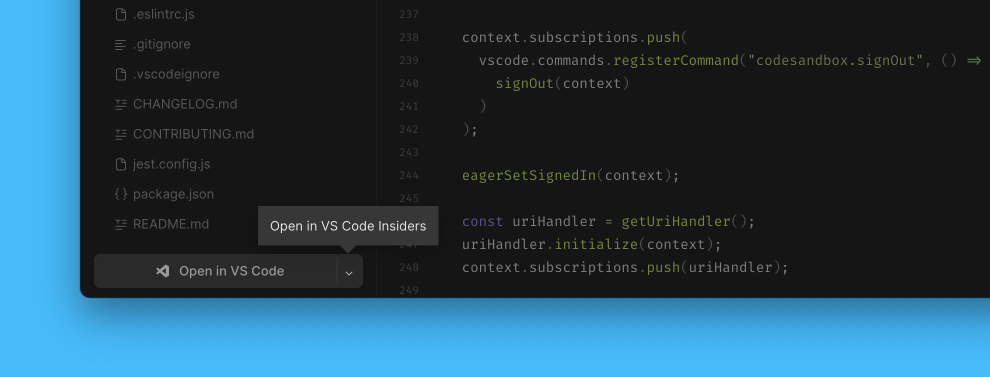
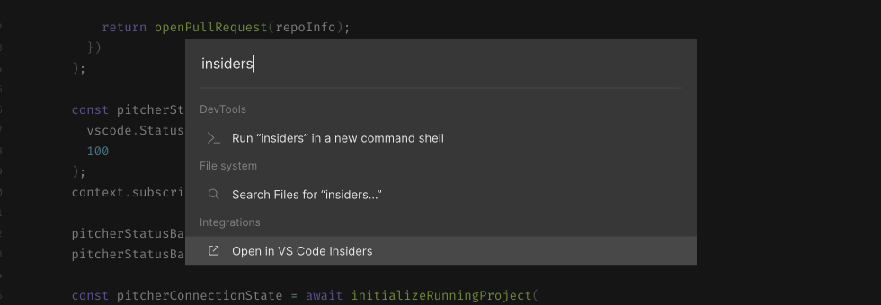
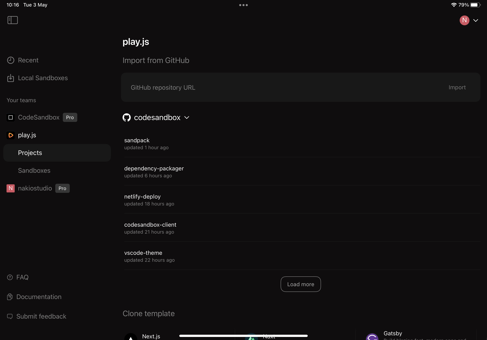

import Callout from 'nextra-theme-docs/callout'
import { Tabs, WrapContent } from '../../../../../shared-components/Tabs'
import Video from '../../../../../shared-components/Video'
import Hero from '../../../../../shared-components/Hero.js'

# Your First Repository

Start working on a Repository by importing an existing repository from GitHub or creating from a template.

<Tabs tabs={["Web", "VS Code", "iOS"]}>
    <WrapContent>
## Importing a Repository

1. Go to the **[Dashboard](https://codesandbox.io/dashboard)**.

<<<<<<< HEAD
2. From the left sidebar, click on the **team** (personal or another) you want to import your project into. New teams can be created from the same menu.
=======
2. From the left sidebar, click on the **team** (personal or another) you want to import your project into. New teams can be created through the dashboard.
>>>>>>> ba935cb (Update Getting Started Content)
  
3. Click on the **`New`** button. In the top right corner.

4. Select **`Import from GitHub`**
    
4. Enter a valid **GitHub URL** or choose a repository from the pre-loaded repository list. 

<Callout emoji="→">
For valid GitHub URLs, follow this format:

**`https://` `github.com/` `:org/` `:repo`**
- Include the protocol, such as `https`;
- Don't include branch name;
- for example `https://github.com/facebook/react`.
</Callout>

- If the search does not return any matches, click on the **`Show all`** button under the last repository visible in the list to load more repositories.

- If not all your GitHub organizations are listed in the dropdown, click on **`Manage GitHub integrations`** to grant the required permissions.
 
6. Click on **Import**. 

## Troubleshooting
   
#### **Permission errors while importing a project**
    
- Verify your team's permission to open CodeSandbox Repositories.

- Verify your **repository permissions on GitHub**. 
You need to have `write` permission on Github to be able to import the project. Repositories where you only have `read` access can only be forked.

- Verify your **GitHub permissions**. 
CodeSandbox Projects requires full git access to be able to import and commit. If you face any  authentication errors, follow the steps to reset your github permissions listed below.
    
    
#### **Resetting Github permissions**

1. Go to the **[Dashboard](https://codesandbox.io/dashboard)**.

1. Click on the **Menu icon** at the top right of the screen.

1. Click on **Preferences**.

  
4. Go to **Integrations**. 

5. **Sign out from GitHub and sign in again** to reconnect your GitHub Account. 
  
#### **Invalid authorization code on Firefox and Safari**
    
Safari and Firefox block popups by default. Please make sure you give the domain permission (through browser settings) or refresh the page after you opened the popup and try again.
    </WrapContent>
    <WrapContent>

## Getting Started

1. If needed, install [Visual Studio Code](https://code.visualstudio.com/) for Windows *(7+)*, macOS *(10.11 +)*, or Linux.
2. Download and install the [CodeSandbox extension](https://marketplace.visualstudio.com/items?itemName=CodeSandbox-io.codesandbox-projects) for Visual Studio Code.
3. Wait for the extension to finish downloading and then reload VS Code when prompted.
4. Click on CodeSandbox icon in the side menu and login 
5. Connect to your project

 
## How it works

When you connect to your CodeSandbox account and open a branch, a virtual container is spun up with [Remote - SSH](https://marketplace.visualstudio.com/items?itemName=ms-vscode-remote.remote-ssh) to allow you to access your code. At the same time, a connection is established with a CodeSandbox API called Pitcher. This is the service that powers all of the collaboration features across different editors including the web and mobile. 

It is possible to work on the ssh connection while disconnected to Pitcher, but you should be mindful that other team members may be making changes to your branch while you are in an un-synced state, so be sure to commit often.

Only people on your team in CodeSandbox have access to these repositories. 

So the VSCode Extension actually connects directly to the container with an SSH connection, completely bypassing Pitcher, where it operates directly with the FileSystem.
On top of this we also connect to Pitcher, just like we do in the browser, where we "tie it together".

 
 
## Using Visual Studio Code Insiders

You can also open your work in [Visual Studio Code Insiders](https://code.visualstudio.com/insiders/) straight from the editor.

 
### In the editor

Once you open the branch, follow these steps:

1. Click on the dropdown icon of the "Open in VS Code" button.
1. In the dropdown menu, click on the "Open in VS Code Insiders" option.

 
### In the command palette

1. Open the command palette: MacOS: <kbd>SHIFT+CMD+P</kbd>; Windows: <kbd>SHIFT+CTRL+P</kbd>;
1. Type "insiders" into the command palette prompt;
1. Under the "Integrations" section, click on the "Open in VS Code Insiders" option.

 
### Preferences

CodeSandbox Projects will remember your choice of the IDE and will use it as the default button action next time you wish to open your project in Visual Studio Code.

You can reset your choice at any time by selecting a different option from the "Open in VS Code" dropdown menu.
    </WrapContent>
     <WrapContent>
## Getting Started

You can start using CodeSandbox Projects from the web, VSCode, or even iOS so choosing the most convenient platform that fits to your workflow. Furthermore, whenever you want just hop between different clients and continue the work on your project where you left off.

 
## Importing a project

Once you have signed into CodeSandbox with your GitHub account you can import your first project. 

You can easily import any public repositories by pasting its GitHub URL into the “GitHub repository URL” field and hitting the “enter” key or the “Import button”. This action will automatically fork the repository and spin a development environment for you to start coding straight away.

In addition, you can create a project from any repository (public or private if you are a Pro user) of any GitHub Organization you belong to or create a new project using one of the templates available.

    </WrapContent>
</Tabs>
    

    
    