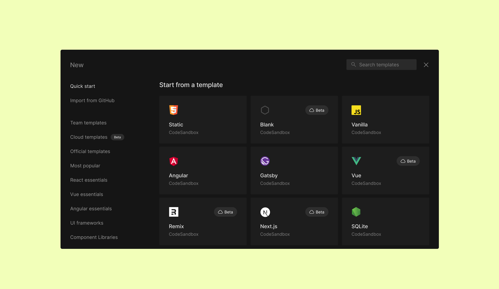
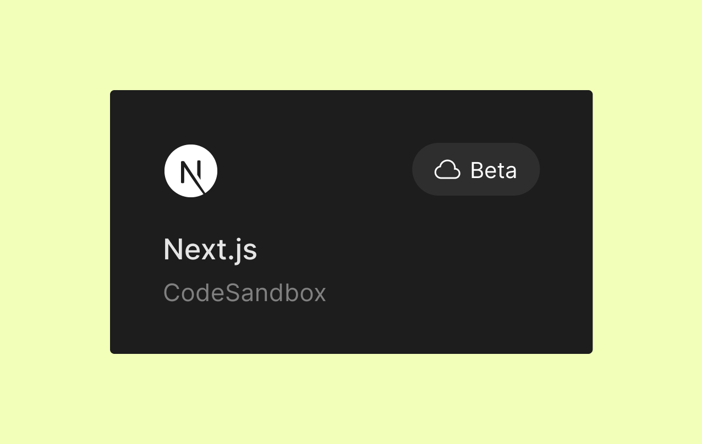
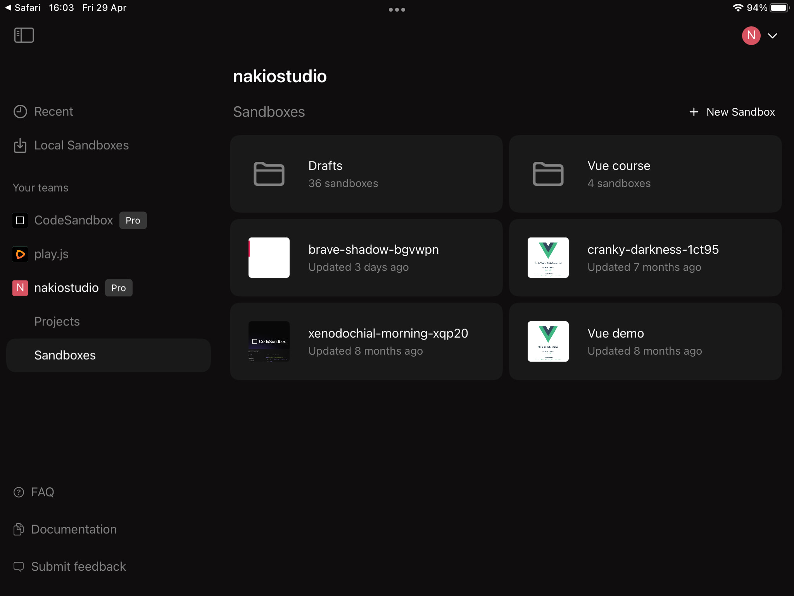

import Callout from 'nextra-theme-docs/callout'
import { Tabs, WrapContent } from '../../../../../shared-components/Tabs'

# Getting Started with Sandboxes
Sandboxes are a great way to get working on your idea with zero startup costs. 

<Tabs tabs={["Browser", "Cloud", "iOS"]}>
    <WrapContent>
## Finding Sandbox Templates

The most popular way of creating a new Sandbox is the 'New' modal.



The **`New`** modal shows you collections of templates grouped first by relevance and then by broad category. This list is not comprehensive of all the Sandboxes that have been made by the community, however. If you want to browse other Sandboxes and Templates, you can explore everything in through the discover button at the bottom of the dashboard sidebar.

Templates are automatically forked when you select them, so you can edit
and begin creating your own sandbox.
<br/>

### Using GitHubBox.com

An easy way to import a repo to CodeSandbox via URL is with GitHubBox.com.
Append 'box' to your github.com URL in between 'hub' and '.com' and it will
redirect to CodeSandbox.

Here's an example:

Change the GitHub URL:
https://github.com/reduxjs/redux/tree/master/examples/todomvc.

To: https://githubbox.com/reduxjs/redux/tree/master/examples/todomvc.

The result is we take the last part of the url (everything after github.com) and
use it in our importer at codesandbox.io/s/github/, adding the repo to
CodeSandbox.
<br/>

### Using a Browser Extension

We have browser extensions for
[Chrome](https://chrome.google.com/webstore/detail/open-in-codesandbox/hdidglkcgdolpoijdckmafdnddjoglia)
and [Firefox](https://addons.mozilla.org/en-GB/firefox/addon/codesandbox/),
which add an 'Open in CodeSandbox' button to GitHub repo pages. This makes it
easy to import existing projects from GitHub in to CodeSandbox.

<br/>
### Setting inference

When importting, we infer sandbox settings based on several files in a
repository.

| Sandbox Setting | Inferred from                                                                                                                                         |
| --------------- | ----------------------------------------------------------------------------------------------------------------------------------------------------- |
| Title           | `name` field in `package.json`                                                                                                                        |
| Description     | `description` field in `package.json`                                                                                                                 |
| Tags            | `keywords` field in `package.json`                                                                                                                    |
| Template        | Based on [this](https://github.com/codesandbox-app/codesandbox-importers/blob/master/packages/import-utils/src/create-sandbox/templates.ts#L63) logic |

If the correct template isn't automatically being used when importing, then you
may specify a `template` property in your `./sandbox.config.json` file to
override the detected template.

```json
{
  "template": "node"
}
```
<br/>

## Import Local projects via CLI

You can import a local project in to CodeSandbox by using our
[CLI](https://github.com/codesandbox-app/codesandbox-importers/tree/master/packages/cli).

You can install our CLI by running `npm install -g codesandbox`. Then import a
project by running `codesandbox {directory}`.
<br/>

### Example usage

```
$ npm install -g codesandbox
$ codesandbox ./
```
<br/>

## Define API

We offer an API that allows you to programmatically create a sandbox. This is
useful for documentation, enabling you to generate a sandbox on the fly from
code examples. You can call the endpoint
`https://codesandbox.io/api/v1/sandboxes/define` both with a `GET` and with a
`POST` request.
<br/>

### Supported Parameters

We currently support three extra parameters. The query accepts the same options
as the [embed options](/learn/sandboxes/embedding).

| Query Parameter | Description                                                                           | Example Input               |
| --------------- | ------------------------------------------------------------------------------------- | --------------------------- |
| `parameters`    | Parameters used to define how the sandbox should be created.                          | Example below               |
| `query`         | The query that will be used in the redirect url.                                      | `view=preview&runonclick=1` |
| `embed`         | Whether we should redirect to the embed instead of the editor.                        | `1`                         |
| `json`          | Instead of redirecting we will send a JSON response with `{"sandbox_id": sandboxId}`. | `1`                         |
<br/>

### How it works

The API only needs one argument: `files`. This argument contains the files that
will be in the sandbox, an example body would be:

```json
{
  "files": {
    "index.js": {
      "content": "console.log('hello!')",
      "isBinary": false
    },
    "package.json": {
      "content": {
        "dependencies": {}
      }
    }
  }
}
```

#### Binary Files

You can import binary files by setting `isBinary` to `true` and `content` as a
URL to the file hosted externally. For example:

```json
{
  "isBinary": true,
  "content": "https://..."
}
```
<br/>

#### Folders

You can create folders by naming the file with a `/` in it's name, allowing to
structure your application how you want:

```json
{
  "files": {
    "src/index.js": {
      "content": "console.log('hello!')",
      "isBinary": false
    },
    "package.json": {
      "content": {
        "dependencies": {}
      }
    }
  }
}
```

This will create a file called `index.js` in your `src` folder.
<br/>

#### Package.json

Every request **requires** a `package.json`. This file can either be a string or
an object. We determine all information of the sandbox from the files, like we
do with the GitHub import.
<br/>

### GET Request

It's very hard to send the JSON parameters with a GET request, there is a chance
of unescaped characters and the URL hits its limit of ~2000 characters quickly.
That's why we first compress the files to a compressed `lz-string`. We offer a
utility function in the `codesandbox` dependency for this. The implementation
looks like this:

```js
import { getParameters } from 'codesandbox/lib/api/define';

const parameters = getParameters({
  files: {
    'index.js': {
      content: "console.log('hello')",
    },
    'package.json': {
      content: { dependencies: {} },
    },
  },
});

const url = `https://codesandbox.io/api/v1/sandboxes/define?parameters=${parameters}`;
```
<br/>

#### Example Sandbox

https://codesandbox.io/s/6yznjvl7nw?editorsize=50&fontsize=14&hidenavigation=1&runonclick=1
<br/>

### POST Form

You can do the exact same steps for a POST request, but instead of a URL you'd
show a form. With a POST request you can create bigger sandboxes.
<br/>

#### Example Sandbox

https://codesandbox.io/s/qzlp7nw34q?editorsize=70&fontsize=14&hidenavigation=1&runonclick=1
<br/>

### Define without render

If you want to define a new sandbox without getting it rendered, you can add
`?json=1` to the request. For instance
`https://codesandbox.io/api/v1/sandboxes/define?json=1`. Instead of the render,
the result will be json data providing you with the `sandbox_id` of the new
sandbox.

This is useful, for instance, if you need to create a new sandbox
programmatically, so you can then embed it on your site (See
[Embed documentation](/learn/sandboxes/embedding)).

Both `get` and `post` requests are supported.
<br/>

### XHR Request

You can also create a sandbox using an XHR request, like using `fetch`. An
example sandbox of that is here:

https://codesandbox.io/s/9loovqj5oy?editorsize=70&fontsize=14&hidenavigation=1&runonclick=1
<br/>

## Import Single Components

You can import a local component in to CodeSandbox by using our other
[CLI](https://github.com/codesandbox/codesandboxer/tree/master/packages/codesandboxer-fs).

You can install our CLI by running `npm install -g codesandboxer-fs`. Then you
can export a project by running `codesandboxer {filePath}`.

```
$ npm install -g codesandboxer-fs
$ codesandboxer docs/examples/my-single-component.js
```

This will print out the id of a sandbox that does nothing but render the
targeted component, along with a link to that sandbox. This will also bundle in
other local files used by the component to ensure render.
<br/>

## Import Using Codesandboxer

[Codesandboxer](https://github.com/codesandbox/codesandboxer) imports a single
file from a git repository, along with supplemental files and dependencies.
Using this creates an easy way to upload an example instead of an entire git
repository. This enables you to easily share examples with others, or to link to
editable versions of examples from a documentation website. React-codesandboxer
is the main version, but there are also versions for VS Code, Atom, and
BitBucket.
<br/>

### How it works

Below the surface, react-codesandboxer fetches the files it needs from GitHub or
BitBucket, using a single file that will be rendered as the 'example' as an
entry point, then uses the Define API to upload the necessary files into a new
`create-react-app` sandbox.

Check out the [codesandboxer docs](https://github.com/codesandbox/codesandboxer)
for information on how to implement it.

```jsx harmony
import React, { Component } from 'react';
import CodeSandboxer from 'react-codesandboxer';

export default () => (
  <CodeSandboxer
    examplePath="examples/file.js"
    gitInfo={{
      account: 'noviny',
      repository: 'react-codesandboxer',
      host: 'github',
    }}
  >
    {() => <button type="submit">Upload to CodeSandbox</button>}
  </CodeSandboxer>
);
```
<br/>

## Import Using Remark-codesandbox

[Remark-codesandbox](https://github.com/kevin940726/remark-codesandbox) is a
remark plugin for creating sandboxes directly from code blocks in documentation.
Developed by CodeSandbox community member Kai Hao, it supports popular platforms
including MDX, Gatsby, Storybook Docs, docz etc. Learn more about it in their
[documentation](https://github.com/kevin940726/remark-codesandbox#remark-codesandbox).
    </WrapContent>
    <WrapContent>
    ## Using Cloud Templates
    This new Sandbox experience is currently in Beta. We will be adding more features in the coming months to offer more prototyping tools. That said, this Sandbox is already a great option for anyone looking to run server-side code. 
    
    To get started, open the 'New' Modal to search through our new selection of Cloud Sandbox Templates. You can recognize a Cloud Sandbox by their special badges.
    <br/> 
    
       
    </WrapContent>
     <WrapContent>

## Overview
Sandboxes on CodeSandbox for web are either bundled inside your web browser using web technologies or work with virtual machines to run the code onthe editor. In contrast, Sandboxes that run on the iOS app run inside a Node.js 12 port. This can cause compatibility issues between iOS and web clients, but we are working hard to narrow this gap down.
<br/>

## Getting Started

Upon launching the app you will first come across the Dashboard. This is the screen where all projects live and where you can create new ones.

### Local Sandboxes

In the “Local Sandboxes” section you can find those sandboxes whose files live locally on your device and that don’t require an internet connection for you to develop and execute them. 

You can either create new local sandboxes using any of the templates available or create an offline fork on a CodeSandbox sandbox.


The first time you open the app you will see two sample projects for you to familiarize with the IDE.

Creating a Sandbox inside the “Local Sandboxes” section will create that prototyping project inside your devices and won’t be available online.

### CodeSandbox Sandboxes

If you complete the “Sign in” flow using your CodeSandbox account you will get automatic access to the CodeSandbox teams you belong to and their sandboxes.



Creating a Sandbox inside the “Sandboxes” section of your team will create a Sandbox remotely on CodeSandbox inside the Collection you were browsing upon tapping on “New Sandbox”. These Sandboxes require internet connection and any changes you make to them will get automatically persisted on the cloud. In addition, any team member visiting that Sandbox will be able to participate on a live coding session.
    </WrapContent>
</Tabs>
