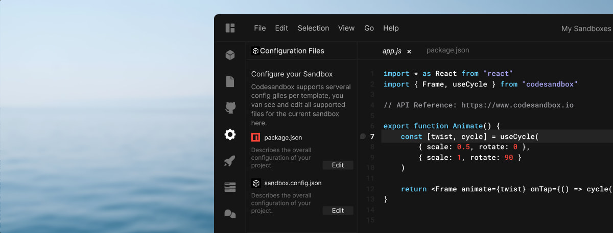
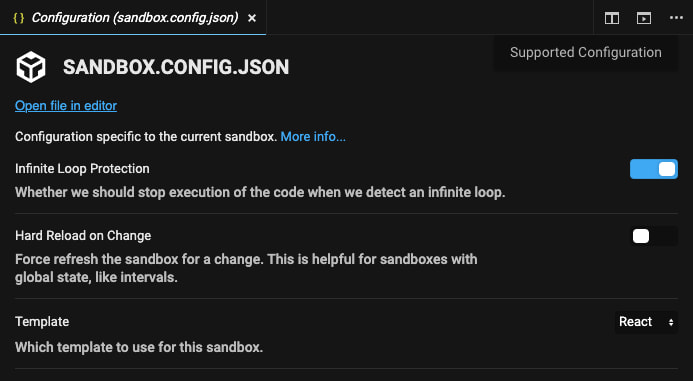

import { Tabs, WrapContent } from '../../../../../shared-components/Tabs'

# Configuration

<Tabs tabs={["Browser", "Cloud"]}>
    <WrapContent>
## Configuration Files

There are some advanced use cases where you might need more control over a
sandbox or template. That's why we support configuration files. Every template
on CodeSandbox has a list of configuration files it supports. You can see the
supported files under Configuration Files from the left-hand activity bar in the
editor.

## Configuration UI

Some configuration files can be configured using a UI. This UI will generate a
configuration file based on its state.

## Sandbox Configuration

A sandbox can be configured too, you can do this with `sandbox.config.json`. We
support these options:

| Option                   | Description                                                                                                                                   | Possible Values                                                                                                | Default Value                                      |
| ------------------------ | --------------------------------------------------------------------------------------------------------------------------------------------- | -------------------------------------------------------------------------------------------------------------- | -------------------------------------------------- |
| `infiniteLoopProtection` | Whether we should throw an error if we detect an infinite loop                                                                                | `true` / `false`                                                                                                 | `true`                                             |
| `hardReloadOnChange`     | Whether we should refresh the sandbox page on every change, good for sandboxes with global state                                              | `true` / `false`                                                                                                 | `false`                                            |
| `template`               | Which sandbox template to use                                                                                                                 | [see here](https://github.com/codesandbox/codesandbox-importers/blob/master/packages/types/index.d.ts#L39-L64) | smart detection, w/ fallback to `"create-react-app"` |
| `view`                   | Which view to show first in the preview                                                                                                       | Client: `"browser"` / `"console"` / `"problems"` / `"tests"` Container: `"browser"` / `"console"` / `"problems"` / `"terminal"`       | `"browser"`                                          |
| `disableLogging`         | Whether we should disable in-browser logging and have all logs created by the sandbox go to the browser console                               | `true` / `false`                                                                                                 | `false`                                            |
| `container`              | The container object contains the port, start script and Node.js major version, for example: `"container": { "port": 3212, "startScript": "custom", "node": "14" }` |
| `port`                   | The main port which the browser window listens to                                                                                             | 1024 - 65535                                                                                                   | First opened port inside the container.            |
| `startScript`            | Explicitly specify the start script used in a container sandbox, overriding the default value                                                 | A String matching a script name defined under `"scripts"` in `package.json`                                      | `"dev"` / `"develop"` / `"serve"` / `"start"`              |
| `node` | The Node.js major version to use inside the container. The exact versions used are as follows: `"10"`: `10.24.1` `"12"`: `12.22.7` `"14"`: `14.18.1` `"16"`: `16.12.0` | `"10"` / `"12"` / `"14"` / `"16"` | `"14"` |
    </WrapContent>
    <WrapContent>
       Configuration on Cloud Sandboxes are handled in the same way as Repositories. [Read more here](TODO: Neco add link)
    </WrapContent>
</Tabs>

