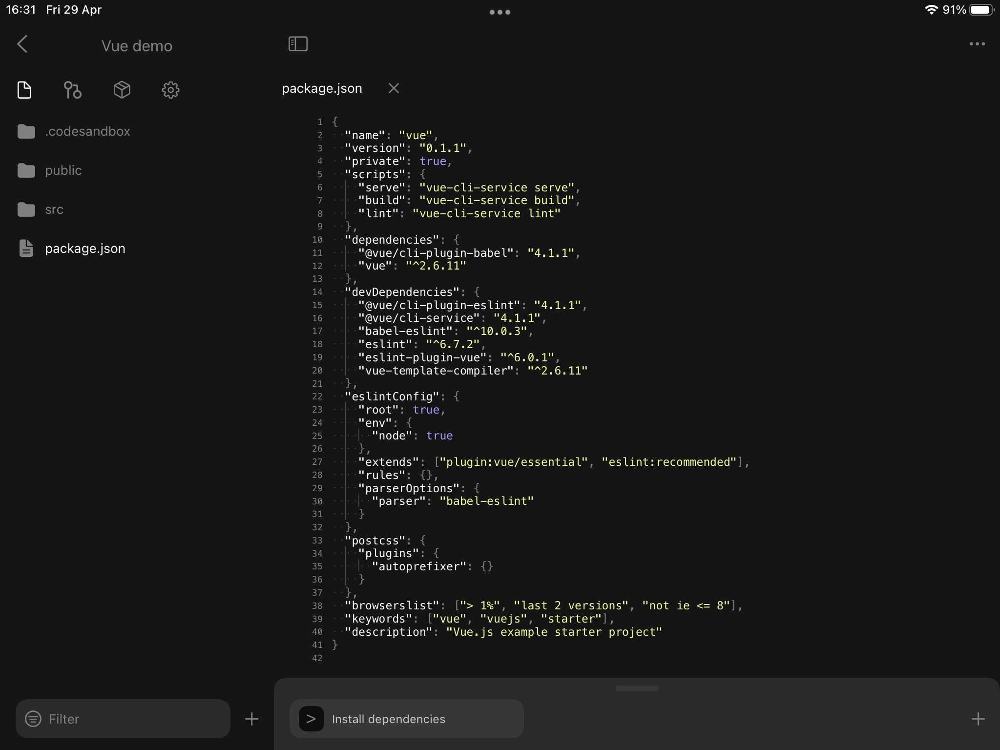
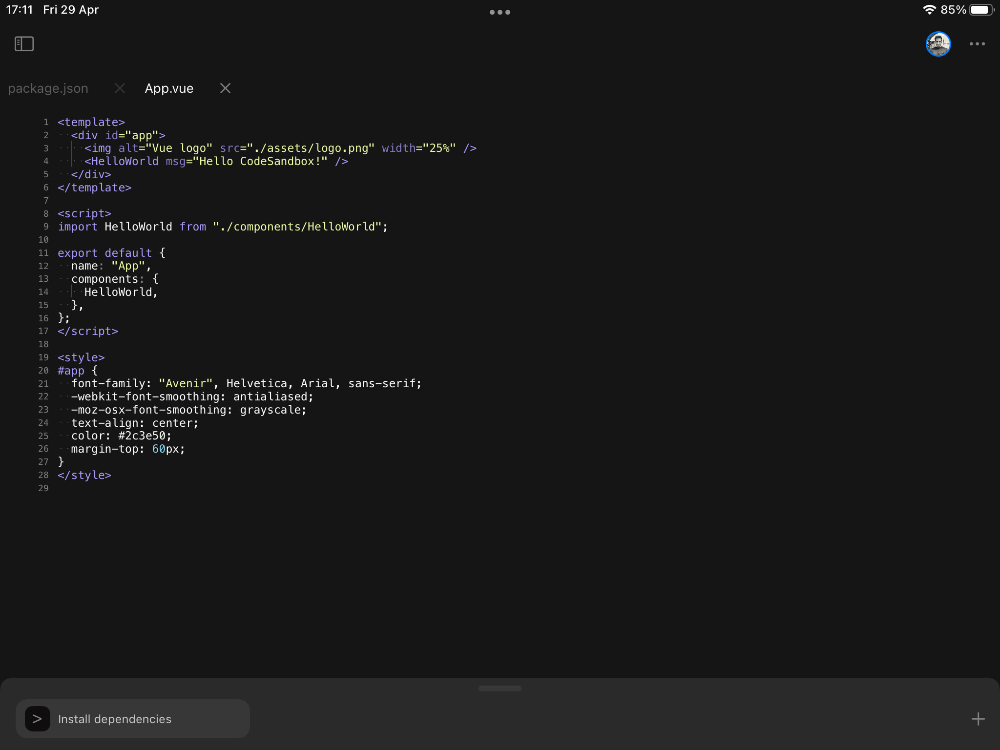
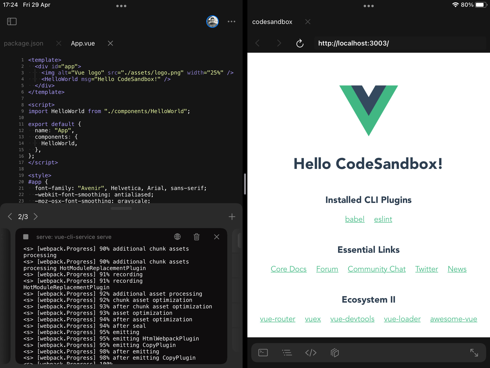
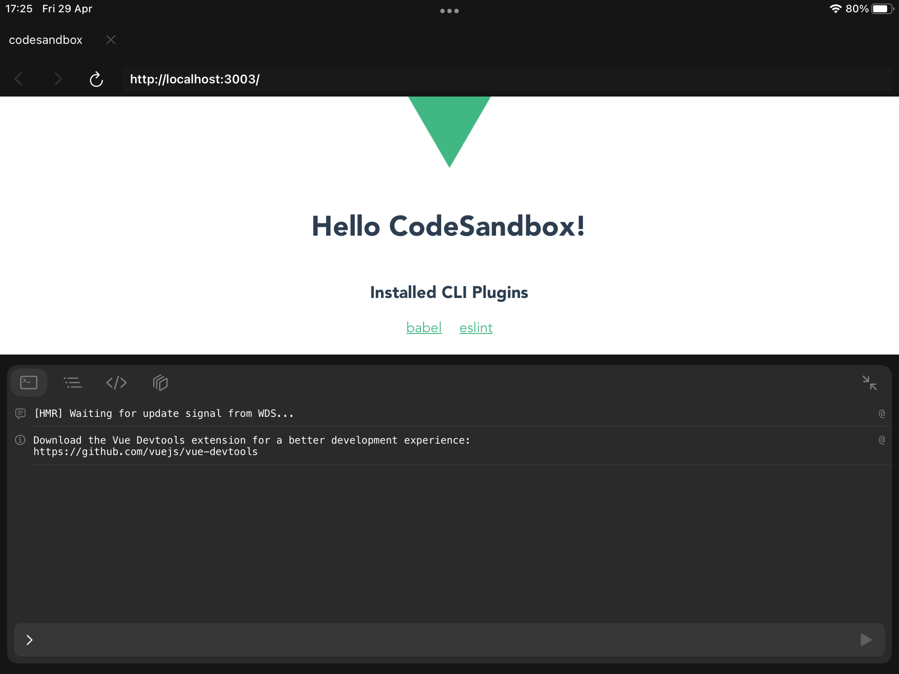
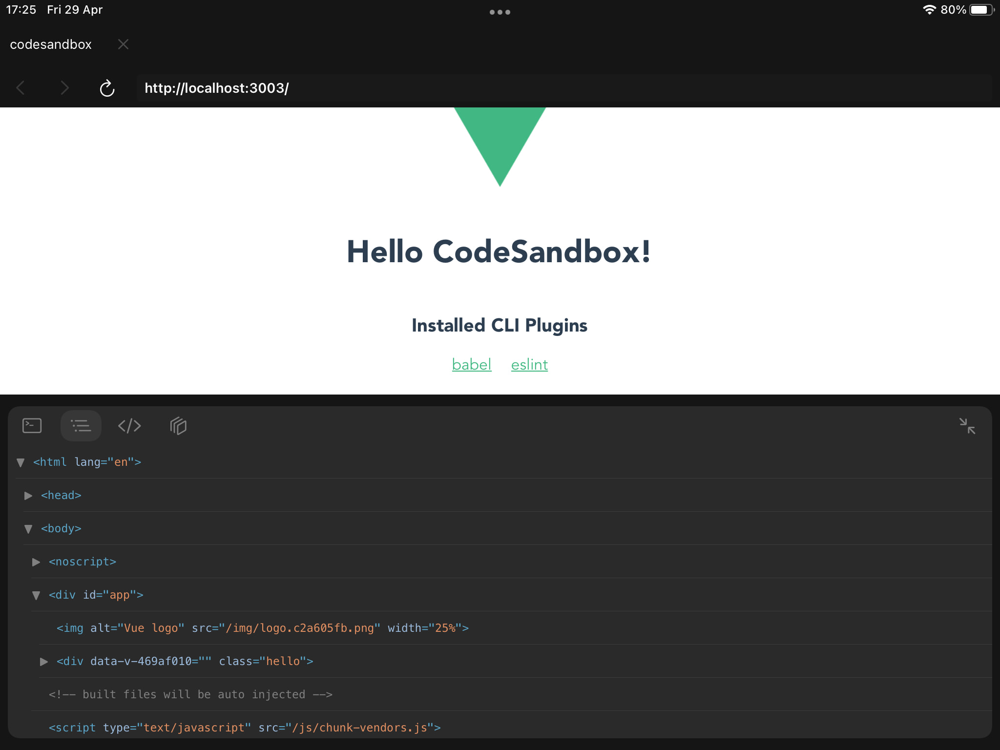
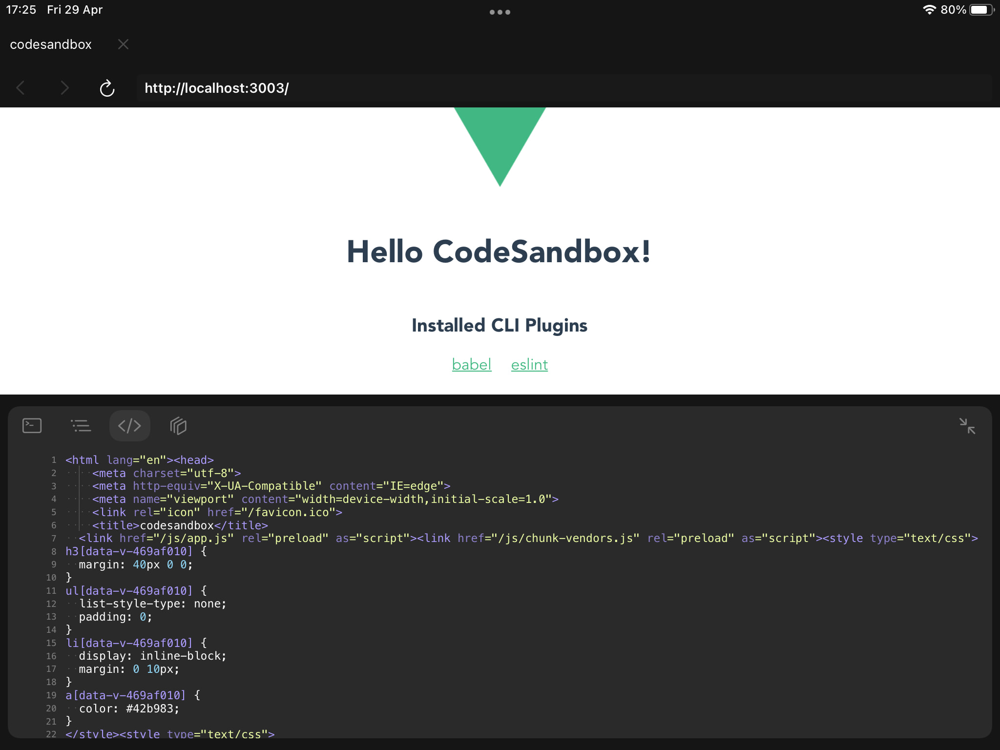

import { Tabs, WrapContent } from '../../../../../shared-components/Tabs'

# Sandbox Editors

Sandboxes are the environment for rapid web development.

<Tabs tabs={["Browser", "Cloud", "iOS"]}>
    <WrapContent>
## Environment

When using CodeSandbox, your code is evaluated and run by one of our built-in
execution environments. These execution environments come in one of two types:
Client and Container.

Client environments run entirely inside of your browser and will continue to
bundle your code even when you lose your connection to our servers. Containers
on the other hand are executed server-side inside of a Docker container
instance.

While Client Sandboxes have faster previews and offline availability, they don't
offer many configuration capabilities. Container Sandboxes take longer to start
up, but effectively behave much like a local development environment, allowing
you to customize your build tools, set up servers to listen to incoming
requests, etc.

### Client Environments

Client Sandboxes each have their own bundler attached to them which are
configured to support a specific framework and emulate their official CLI tools.
They are not one-to-one implementations and thus do not support advanced
configuration like custom webpack configurations or ejecting. However, they are
designed to mirror the default behavior of the framework. If your project
requires advanced configuration, try using a Container Sandbox instead.

Currently it is not possible to convert a Client Sandbox to a Container Sandbox.

### Container Environment

Container Sandboxes run by connecting to a Docker instance running on our
servers. We use the [official Node docker image](https://hub.docker.com/_/node)
in our container instances, meaning most Node packages should be supported out
of the box. With Containers, you can run your own bundlers such as Webpack and
retain full control over its configuration.

Containers also support running NPM scripts defined in your `package.json`. We
run a few of these scripts automatically to start up your server. See the list
below for which scripts we run automatically and what their priority is:

- `dev`
- `develop`
- `serve`
- `start`

While you can also lint your code using ESLint via the command line in
containers, we don't currently support custom ESLint configs in the editor
itself.

Unlike Client Sandboxes, Containers also expose access to the Terminal. This
allows you to run most commands you'd normally expect to be able to run in the
command line. However, you don't have root access. Also, keep in mind that
running certain commands which alter the filesystem of the container instance
will cause the files shown in the Editor to become out of sync, such as manually
running `yarn add` or running `git` commands. We don't sync files and
directories that are ignored via `.gitignore`, and there is a sync limit of 10
files per second and a maximum file size of 2mb.

## How can I tell if I am in a container sandbox?

When you are in a container sandbox, an environment variable called
`CODESANDBOX_SSE` will be available and you can always use it to check what your
current environment is.

https://codesandbox.io/s/codesandboxsse-example-spgyv

    </WrapContent>
    <WrapContent>
       content tab 2
    </WrapContent>
     <WrapContent>
        ## Sandboxes on iOS

Sandboxes are the perfect kind of project for the times you have an idea you want to quickly prototype on the go. They are lightweight and can be shared easily.

Sandboxes on CodeSandbox for web are bundled inside your web browser using web technologies, whereas sandboxes running on the iOS app are run inside a Node.js 12 port. This can cause compatibility issues between iOS and web clients, but we are working hard to narrow this gap down.

## Getting Started

Upon launching the app you will first come across the Dashboard. This is the screen where all projects live and where you can create new ones.

### Local Sandboxes

In the “Local Sandboxes” section you can find those sandboxes whose files live locally on your device and that don’t require an internet connection for you to develop and execute them. 

You can either create new local sandboxes using any of the templates available or create an offline fork on a CodeSandbox sandbox.

The first time you open the app you will see two sample projects for you to familiarize with the IDE.

Creating a Sandbox inside the “Local Sandboxes” section will create that prototyping project inside your devices and won’t be available online.
 
### CodeSandbox Sandboxes

If you complete the “Sign in” flow using your CodeSandbox account you will get automatic access to the CodeSandbox teams you belong to and their sandboxes.

Creating a Sandbox inside the “Sandboxes” section of your team will create a Sandbox remotely on CodeSandbox inside the Collection you were browsing upon tapping on “New Sandbox”. These Sandboxes require internet connection and any changes you make to them will get automatically persisted on the cloud. In addition, any team member visiting that Sandbox will be able to participate on a live coding session.
 

### Creating a Sandbox

You can create a Sandbox from multiple sources and various types:

- Empty: these Sandboxes only contain a `package.json` files and a `index.js` file acting as the entry point of your program.
- Git repositories (Local Sandboxes only): you can clone a project from a Git repository, and to do it you’ll need to setup your credentials first under the “Git settings” section.
- Local templates: you can use one of the React.js, Vue.js or Next.js templates bundled in the app.
- CodeSandbox templates: you can use one of the compatible CodeSandbox templates available. It’s required to have a CodeSandbox account to access these.
- CodeSandbox Sandboxes: you can create a Local Sandbox from a CodeSandbox Sandbox by long tapping any Sandbox on the Dashboard and selecting the option “Import Sandbox”.

Creating a Local Sandbox

Creating a CodeSandbox Sandbox
 

## Development Environment

Once you have selected or created your Sandbox it is time to code and get your creativity flowing. In this section we will explain the different parts of the IDE and how they work.

 

### Sidebar

**Files Browser**
The place where you can manage the files and directories of your Sandbox. Long press any item on the list or click it with your mouse secondary button to see the actions available.

At the bottom of the Files Browser there is also a “Filter” field for you to quickly filter the files in the directories tree by a given term.

**Git Client**

Local Sandboxes include a Git Client that allows you to perform basic Git operations. You can either use it for version control or to keep your sandbox synchronized with a Git repository.

From this client you can:

- Commit changes.
- Discard changes.
- Push and pull changes from a remote branch.
- Manage the branches of your repository.
- Configure a remote Git repository.

**Manage dependencies**

Most Node.js applications need third party dependencies to work. The Dependencies screen parses your sandbox’ `package.json` file and offers a thin UI layer to manage your dependencies. This is: adding new dependencies, removing existing ones or triggering the dependencies installation process.

Remember that most of the sandboxes will require you to install the dependencies before running your app.

**Settings**

This is where you can tune the Editor experience and, in some cases, edit the metadata of your Sandbox.

 

### Editor

The central place in the application and arguably where you will spend most of the time. The Editor offers various features to ease the development experience, offering syntax highlighting for 20 different language and IntelliSense for JavaScript source files.

At the top right of the screen you can see which users have joined the live coding session (only for CodeSandbox Sandboxes) and access to different actions by tapping on the ellipsis button.

 

### Runtime

At the bottom of the Editor you will find everything you need to execute the scripts defined in your `package.json` file. By clicking on the “+” icon the list of the scripts available will show up. 

In case there is no scripts defined in your `package.json` file, the application will show a default `node index.js` action that will try to run an `index.js` file located at the root of your sandbox.

Tapping on any of these scripts will get a Node.js program running and an interactive console for it will be shown.

At the left of the interactive console there is a play/stop button that allows you to control the execution state of the program, whereas at the right you have a button to open the web preview for the port reserved for this console (available via `process.env['PORT']`), a button to clear the output of the program and another button to close the console. Closing a console won’t stop the program so you can reopen a console running in the background by tapping on it inside the “Scripts” list visible upon tapping on the “+” button.

 

### Web Browser

You can preview any web app being developed in the IDE using the in-app web browser. It provides various debugging tools and facilitates opening a preview using the right [localhost](http://localhost) port.

You can open it at any time by tapping on the “globe” icon at top-right corner of every running script console.

The in-app web browser offers a console, a node browser, a source code viewer and a layer inspector to help you debug your web apps.

**Console**

**Nodes browser (long tap any node to see options)**

**Source code viewer**

**3D layers inspector**

    </WrapContent>
</Tabs>