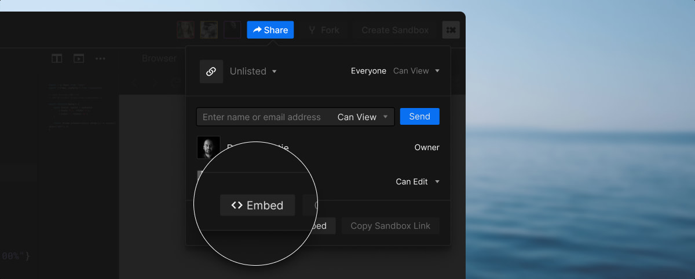

import { Callout } from 'nextra-theme-docs'

# Embedding
<Callout>
**Note: Currently only available for Browser Sandboxes**
</Callout>

## What is an Embed?

An embed enables you to include a sandbox in your documentation, blog post, or
website using an iframe, or anywhere with Embedly support, like Medium, Reddit,
Trello, and Notion. You can show just the code, the preview, or both at the same
time.

CodeSandbox has a separate application for the embed. This application is
specifically built to be as small as possible. If you replace `s` in the URL of
a sandbox to `embed` you have the embed version of the sandbox. Example:
https://codesandbox.io/s/new => https://codesandbox.io/embed/new. Notice that
the embed doesn't have all of the features of the full editor.

## Generate an Embed URL

You can generate a URL to embed by clicking 'Embed' in the header on the editor
and selecting the options you want to have enabled.



## Embed on Medium

You can easily embed on Medium by taking your sandbox URL (like
https://codesandbox.io/s/new) and pasting it in a Medium article. It should
automatically become an embed after you press enter.

## Embed Options

The options shown in the embed modal are not all options available. We need a
new UI for the share model to reflect these options, in the meantime you can
find them here.

| Option           | Description                                                                                                    | Values                               | Default                              |
| ---------------- | -------------------------------------------------------------------------------------------------------------- | ------------------------------------ | ------------------------------------ |
| `autoresize`     | Automatically resize the embed to the content (only works on Medium).                                          | `0`/`1`                              | `0`                                  |
| `codemirror`     | Use CodeMirror editor instead of Monaco (decreases embed size significantly).                                  | `0`/`1`                              | `0`                                  |
| `editorsize`     | Size in percentage of editor.                                                                                  | number                               | `50`                                 |
| `eslint`         | Use eslint (increases embed size significantly).                                                               | `0`/`1`                              | `0`                                  |
| `expanddevtools` | Start with the devtools (console) open.                                                                        | `0`/`1`                              | `0`                                  |
| `hidedevtools`   | Hide the DevTools bar of the preview.                                                                          | `0`/`1`                              | `0`                                  |
| `fontsize`       | Font size of editor                                                                                            | number (in px)                       | `14`                                 |
| `forcerefresh`   | Force a full refresh of frame after every edit.                                                                | `0`/`1`                              | `0`                                  |
| `hidenavigation` | Hide the navigation bar of the preview.                                                                        | `0`/`1`                              | `0`                                  |
| `highlights`     | Which lines to highlight (only works in CodeMirror)                                                            | comma separated list of line numbers |                                      |
| `initialpath`    | Which url to initially load in address bar                                                                     | string                               | `/`                                  |
| `module`         | Which module to open by default. Multiple paths comma separated are allowed, in that case we show them as tabs | path to module (starting with `/`)   | entry path                           |
| `moduleview`     | Evaluate the file that is open in the editor.                                                                  | `0`/`1`                              | `0`                                  |
| `previewwindow`  | Which preview window to open by default                                                                        | `console`/`tests`/`browser`          | `browser`                            |
| `runonclick`     | Only load the preview when the user says so.                                                                   | `0`/`1`                              | `0`                                  |
| `view`           | Which view to open by default                                                                                  | `editor`/`split`/`preview`           | `split`, `preview` for small screens |
| `theme`          | Which theme to show for the embed                                                                              | `dark`/`light`                       | `dark`                               |

## Example Embeds

These are some examples of embeds, based on their properties.

### Smallest Embed

This embed is focused on being as light as possible:

```md
https://codesandbox.io/embed/new?codemirror=1
```

Use this code to embed:

```html
<iframe
  src="https://codesandbox.io/embed/new?codemirror=1"
  style="width:100%; height:500px; border:0; border-radius: 4px; overflow:hidden;"
  allow="accelerometer; ambient-light-sensor; camera; encrypted-media; geolocation; gyroscope; hid; microphone; midi; payment; usb; vr; xr-spatial-tracking"
  sandbox="allow-forms allow-modals allow-popups allow-presentation allow-same-origin allow-scripts"
></iframe>
```

That will give to a result like this:

https://codesandbox.io/s/new?codemirror=1

### Code Example Embed

You can also use CodeSandbox to show code examples, with highlighted lines. This
is only supported with the CodeMirror editor currently:

```md
https://codesandbox.io/embed/new?codemirror=1&highlights=11,12,13,14
```

Use this code to embed:

```html
<iframe
  src="https://codesandbox.io/embed/new?codemirror=1&highlights=6,7,8,9"
  style="width:100%; height:500px; border:0; border-radius: 4px; overflow:hidden;"
  allow="accelerometer; ambient-light-sensor; camera; encrypted-media; geolocation; gyroscope; hid; microphone; midi; payment; usb; vr; xr-spatial-tracking"
  sandbox="allow-forms allow-modals allow-popups allow-presentation allow-same-origin allow-scripts"
></iframe>
```

That will give to a result like this:

https://codesandbox.io/s/new?codemirror=1&highlights=6,7,8,9