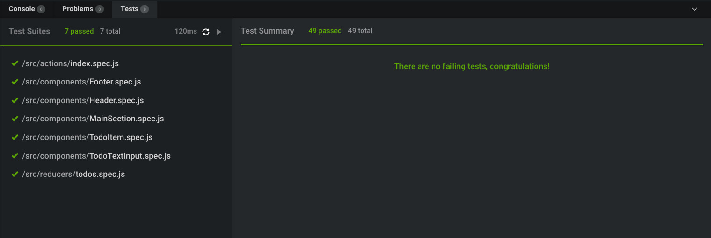
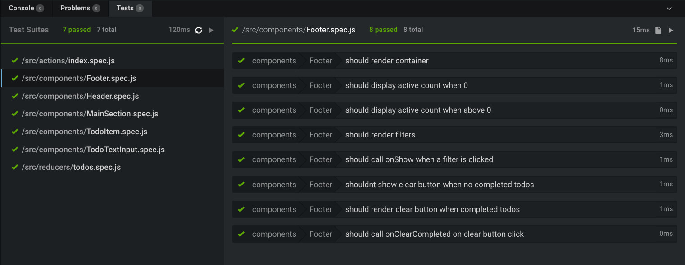

import { Tabs, WrapContent } from '../../../../../shared-components/Tabs'

# Tests

<Tabs tabs={["Browser", "Cloud"]}>
    <WrapContent>

## How do Browser Sandboxes run tests?

CodeSandbox uses [Jest](https://jestjs.io) library to run the tests directly in
the browser. That means you can write tests, but adding additional plugins is
not possible in the Client Sandbox experience.

 
## How to write tests in the CodeSandbox Browser Sandboxes

In [Client sandboxes](/docs/environment) you can run Jest tests by creating
files that end with `.test.js`, `.spec.js`, `.test.ts(x)` and `.spec.js(x)`. We
will automatically detect these test files and show the results in the Tests
tab.

Note: In [Container sandboxes](/docs/environment) you can still use Jest (or
whichever test framework you want), but we don't auto-detect these and you'd
need to set it up yourself as you would locally.

The left side of the test view is an overview of all test files. The right side
shows the details of a file when you select it. You can decide re-run tests
manually by clicking on the Play icon. We automatically watch for file changes,
but you can disable this by clicking on the 'Refresh' icon on the left side.

 
## Test Failures

We show failed tests in two ways: in the test overview and in the code editor
itself.

A failed test looks like this in the Test View:

And will also show squiggles in the editor:

 
## Example

Here's a failing Jest test running in a sandbox:

https://codesandbox.io/s/n9m2w9q8x0?view=preview
    </WrapContent>
    <WrapContent>
    In Cloud Sandboxes, you can run your tests in the Sidekick. Add any testing tool to your codebase and add a script to run the tests to your DevTools. 
    Run the tests at anytime to see a window open with your tests or run a script to watch the tests and checkout the sidekick window anytime you would like to see them.
    </WrapContent>
</Tabs>

